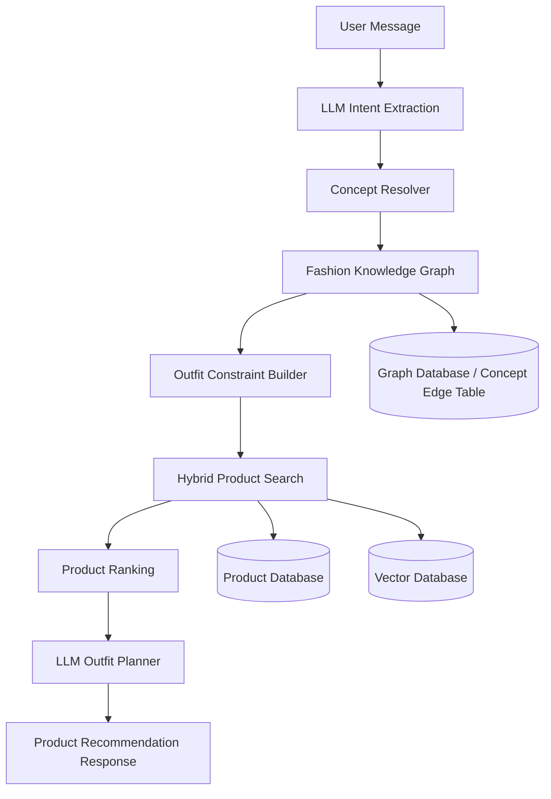
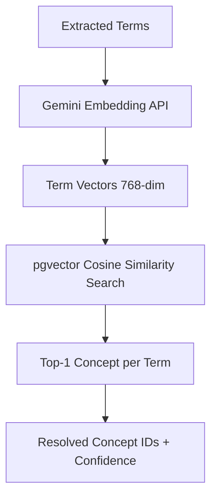
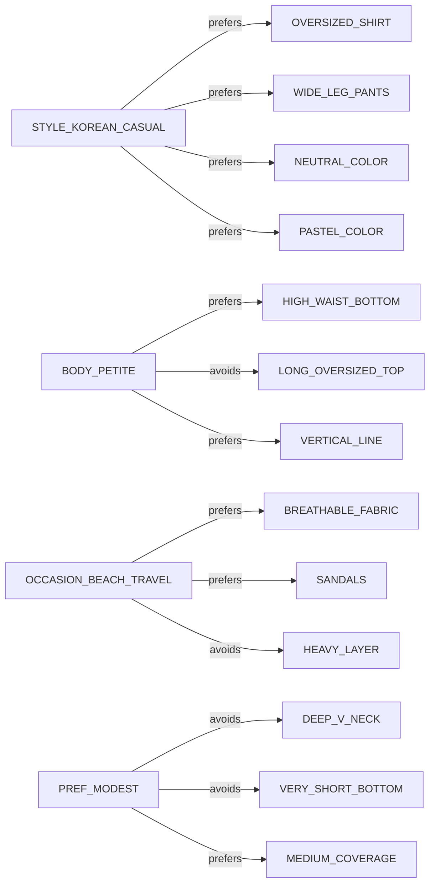
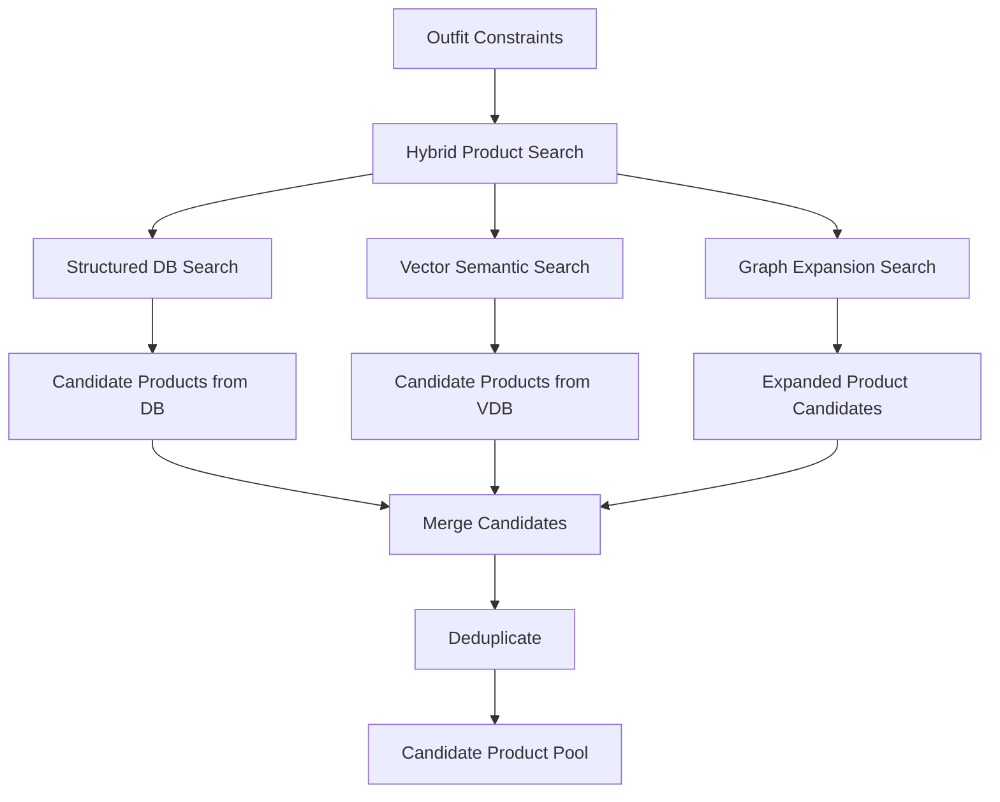
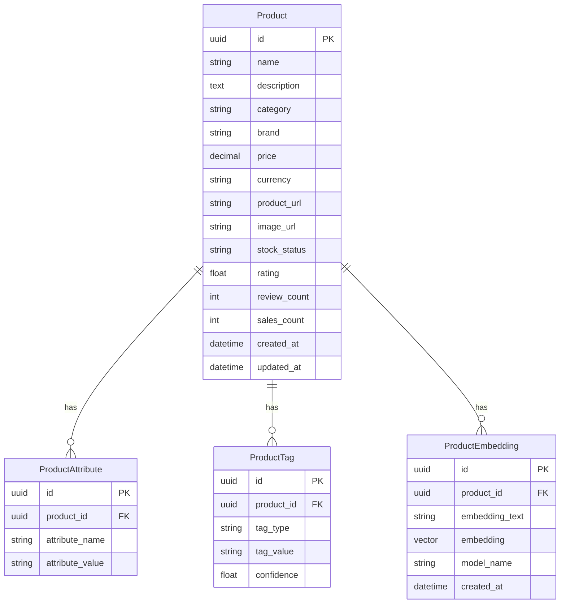
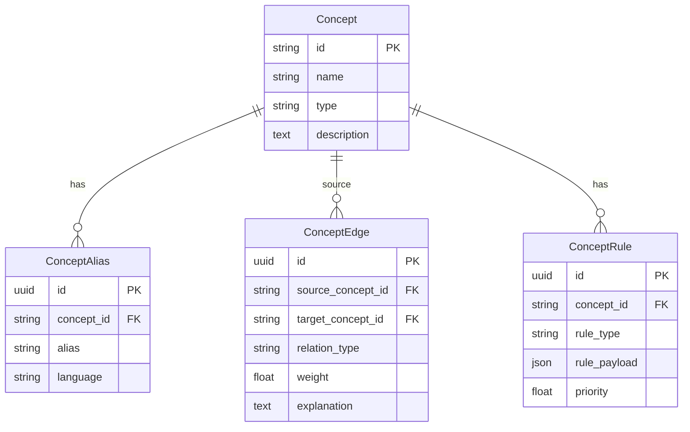
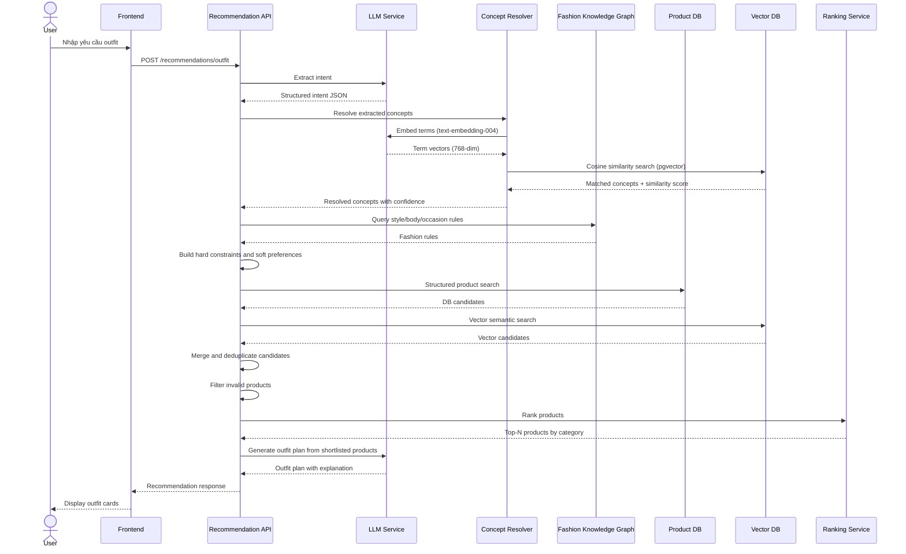

# AI Outfit Recommendation Pipeline

## 1. Overview

Pipeline này mô tả luồng xử lý từ câu hỏi tự nhiên của user đến kết quả gợi ý outfit có sản phẩm cụ thể.

Mục tiêu chính:

* Hiểu đúng nhu cầu thời trang của user.
* Chuẩn hóa các khái niệm mơ hồ như “style Hàn”, “du lịch biển”, “không quá hở”, “hơi thấp”.
* Sử dụng Fashion Knowledge Graph để lấy rule phối đồ.
* Tìm sản phẩm thật từ Product Database và Vector Database.
* Rank sản phẩm theo độ phù hợp.
* Dùng LLM để tạo outfit plan cuối cùng có giải thích rõ ràng.

Pipeline không nên để LLM tự bịa sản phẩm. LLM chỉ nên dùng ở 2 vị trí chính:

1. **Intent Extraction**: hiểu câu user và trích xuất intent.
2. **Outfit Planner**: tạo outfit từ danh sách sản phẩm thật đã được search/rank.

---

## 2. High-level Architecture



---

## 3. Example User Query

Ví dụ user nhập:

```text
Tôi hơi thấp, đi Vũng Tàu 3 ngày 2 đêm, muốn style Hàn, không quá hở nhưng vẫn mát. Chọn đồ giúp tôi.
```

Hệ thống cần hiểu được:

```json
{
  "intent": "outfit_recommendation",
  "body_context": {
    "height": "short_or_petite"
  },
  "trip": {
    "destination": "Vung Tau",
    "duration": "3 days 2 nights",
    "environment": ["beach", "hot_weather", "travel"]
  },
  "style_preferences": ["korean_style"],
  "modesty": "not_too_revealing",
  "comfort": ["cool", "breathable"],
  "output_type": "multi_day_outfit_plan"
}
```

---

# 4. Detailed Pipeline

---

## Stage 1: User Message

### Responsibility

Nhận input text tự nhiên từ user.

### Input

```text
Tôi hơi thấp, đi Vũng Tàu 3 ngày 2 đêm, muốn style Hàn, không quá hở nhưng vẫn mát. Chọn đồ giúp tôi.
```

### Output

Raw message được gửi vào Backend API.

```json
{
  "user_id": "U001",
  "message": "Tôi hơi thấp, đi Vũng Tàu 3 ngày 2 đêm, muốn style Hàn, không quá hở nhưng vẫn mát. Chọn đồ giúp tôi.",
  "language": "vi"
}
```

### Notes

Ở bước này chưa nên search sản phẩm ngay.

Lý do:

* “hơi thấp” không phải keyword sản phẩm.
* “Vũng Tàu” cần được hiểu là beach/coastal/hot weather trip.
* “style Hàn” cần map sang Korean casual, minimal, soft tone.
* “không quá hở” cần biến thành rule về coverage, neckline, skirt length.
* “vẫn mát” cần biến thành fabric/material/silhouette constraint.

---

## Stage 2: LLM Intent Extraction

### Responsibility

Dùng LLM để trích xuất thông tin có cấu trúc từ câu tự nhiên.

### Input

```json
{
  "message": "Tôi hơi thấp, đi Vũng Tàu 3 ngày 2 đêm, muốn style Hàn, không quá hở nhưng vẫn mát. Chọn đồ giúp tôi."
}
```

### Processing

LLM phân tích câu user thành các nhóm:

| Nhóm          | Ví dụ                  |
| ------------- | ---------------------- |
| Intent        | outfit recommendation  |
| User context  | hơi thấp               |
| Destination   | Vũng Tàu               |
| Occasion      | đi du lịch             |
| Duration      | 3 ngày 2 đêm           |
| Style         | style Hàn              |
| Modesty       | không quá hở           |
| Comfort       | vẫn mát                |
| Output format | gợi ý outfit theo ngày |

### Output

```json
{
  "intent": "outfit_recommendation",
  "occasion": "travel",
  "destination": "Vung Tau",
  "duration": {
    "days": 3,
    "nights": 2
  },
  "style_preferences": [
    "korean_style"
  ],
  "body_context": {
    "height_group": "short_or_petite"
  },
  "modesty_level": "medium_high",
  "comfort_needs": [
    "cool",
    "breathable"
  ],
  "avoid": [
    "too_revealing",
    "too_heavy",
    "too_formal"
  ],
  "required_output": {
    "type": "multi_day_outfit_plan",
    "number_of_days": 3
  }
}
```

### Implementation Notes

Nên ép LLM trả về JSON schema cố định.

Ví dụ schema:

```json
{
  "intent": "string",
  "occasion": "string",
  "destination": "string",
  "duration": {
    "days": "number",
    "nights": "number"
  },
  "style_preferences": ["string"],
  "body_context": {
    "height_group": "string",
    "body_shape": "string | null"
  },
  "modesty_level": "string",
  "comfort_needs": ["string"],
  "avoid": ["string"],
  "required_output": {
    "type": "string",
    "number_of_days": "number"
  }
}
```

---

## Stage 3: Concept Resolver

### Responsibility

Chuẩn hóa các từ user nhập thành canonical concept trong hệ thống.

Ví dụ:

```text
style Hàn
```

Có thể được user viết thành:

```text
style Hàn
gu Hàn Quốc
Korean style
ulzzang
minimal Hàn
phong cách Hàn
```

Tất cả nên được map về concept chuẩn:

```text
STYLE_KOREAN_CASUAL
```

---

### Input

```json
{
  "style_preferences": ["korean_style"],
  "destination": "Vung Tau",
  "body_context": {
    "height_group": "short_or_petite"
  },
  "modesty_level": "medium_high",
  "comfort_needs": ["cool", "breathable"]
}
```

---

### Processing

Concept Resolver dùng **semantic search** (Gemini `text-embedding-004` + pgvector):



Mỗi concept trong DB được index sẵn một vector embedding tổng hợp từ `name + type + description + aliases`. Khi resolve, từng term được embed và so sánh cosine similarity với toàn bộ concept pool.

Threshold mặc định: `0.65`. Term có similarity thấp hơn sẽ bị bỏ qua.

---

### Semantic Search Result

Output:

```json
{
  "resolved_concepts": [
    {
      "input": "style Hàn",
      "concept_id": "STYLE_KOREAN_CASUAL",
      "concept_type": "style",
      "confidence": 0.94
    },
    {
      "input": "Vũng Tàu",
      "concept_id": "OCCASION_BEACH_TRAVEL",
      "concept_type": "occasion",
      "confidence": 0.91
    },
    {
      "input": "hơi thấp",
      "concept_id": "BODY_PETITE",
      "concept_type": "body_context",
      "confidence": 0.88
    },
    {
      "input": "không quá hở",
      "concept_id": "PREF_MODEST",
      "concept_type": "preference",
      "confidence": 0.9
    },
    {
      "input": "vẫn mát",
      "concept_id": "FABRIC_BREATHABLE",
      "concept_type": "material_property",
      "confidence": 0.87
    }
  ]
}
```

---

## Stage 4: Fashion Knowledge Graph Query

### Responsibility

Dùng các concept đã resolve để lấy rule phối đồ.

Ví dụ:

```text
STYLE_KOREAN_CASUAL
BODY_PETITE
OCCASION_BEACH_TRAVEL
PREF_MODEST
FABRIC_BREATHABLE
```

Từ đó query Fashion Knowledge Graph để lấy:

* Style rules
* Body proportion rules
* Occasion rules
* Weather rules
* Modesty rules
* Item compatibility rules

---

### Graph Example



---

### Output

```json
{
  "style_rules": [
    {
      "rule": "prefer neutral or pastel colors",
      "source_concept": "STYLE_KOREAN_CASUAL",
      "weight": 0.8
    },
    {
      "rule": "prefer clean minimal items",
      "source_concept": "STYLE_KOREAN_CASUAL",
      "weight": 0.75
    },
    {
      "rule": "prefer relaxed silhouette",
      "source_concept": "STYLE_KOREAN_CASUAL",
      "weight": 0.7
    }
  ],
  "body_rules": [
    {
      "rule": "prefer high-waist bottoms",
      "source_concept": "BODY_PETITE",
      "weight": 0.9
    },
    {
      "rule": "avoid long oversized tops",
      "source_concept": "BODY_PETITE",
      "weight": 0.85
    },
    {
      "rule": "prefer cropped or tucked-in tops",
      "source_concept": "BODY_PETITE",
      "weight": 0.8
    }
  ],
  "occasion_rules": [
    {
      "rule": "prefer breathable fabrics",
      "source_concept": "OCCASION_BEACH_TRAVEL",
      "weight": 0.9
    },
    {
      "rule": "prefer sandals or comfortable shoes",
      "source_concept": "OCCASION_BEACH_TRAVEL",
      "weight": 0.8
    },
    {
      "rule": "avoid thick/heavy layers",
      "source_concept": "OCCASION_BEACH_TRAVEL",
      "weight": 0.85
    }
  ],
  "modesty_rules": [
    {
      "rule": "avoid deep neckline",
      "source_concept": "PREF_MODEST",
      "weight": 0.9
    },
    {
      "rule": "avoid very short bottoms",
      "source_concept": "PREF_MODEST",
      "weight": 0.9
    },
    {
      "rule": "prefer medium coverage",
      "source_concept": "PREF_MODEST",
      "weight": 0.8
    }
  ],
  "required_categories": [
    "top",
    "bottom",
    "dress",
    "shoes",
    "accessory"
  ]
}
```

---

## Stage 5: Outfit Constraint Builder

### Responsibility

Biến các rule từ Knowledge Graph thành constraint cụ thể để search và rank sản phẩm.

Có 4 loại output chính:

1. Hard constraints
2. Soft preferences
3. Search queries
4. Ranking features

---

## 5.1 Hard Constraints

Hard constraints là điều kiện bắt buộc.

Sản phẩm vi phạm hard constraints sẽ bị loại.

### Example

```json
{
  "hard_constraints": {
    "stock_status": ["in_stock"],
    "occasion_tags": ["travel", "beach", "casual"],
    "coverage_level": ["medium", "high"],
    "fabric_property": ["breathable", "lightweight"],
    "excluded_neckline": ["deep_v", "strapless"],
    "excluded_length": ["very_short"],
    "excluded_fabric": ["wool", "leather", "thick_denim"],
    "excluded_style": ["formal", "winter", "party_sexy"]
  }
}
```

---

## 5.2 Soft Preferences

Soft preferences không bắt buộc, nhưng nếu sản phẩm match thì được cộng điểm.

### Example

```json
{
  "soft_preferences": {
    "style": [
      "korean_casual",
      "minimal",
      "soft_feminine",
      "ulzzang"
    ],
    "color": [
      "white",
      "cream",
      "beige",
      "pastel_blue",
      "light_pink"
    ],
    "top": [
      "short_sleeve_shirt",
      "light_blouse",
      "cropped_cardigan",
      "linen_shirt"
    ],
    "bottom": [
      "high_waist",
      "wide_leg",
      "midi_skirt",
      "a_line_skirt"
    ],
    "shoes": [
      "sandal",
      "flat",
      "white_sneaker"
    ]
  }
}
```

---

## 5.3 Search Query Builder

Tạo query cho từng loại search.

### Structured Search Query

Dùng cho Product Database.

```json
{
  "categories": ["top", "bottom", "dress", "shoes", "accessory"],
  "style_tags": ["korean_casual", "minimal", "soft_feminine"],
  "occasion_tags": ["travel", "beach", "casual"],
  "fabric_tags": ["breathable", "lightweight", "linen", "cotton"],
  "coverage_level": ["medium", "high"],
  "stock_status": "in_stock"
}
```

### Vector Search Query

Dùng cho Vector Database.

```text
Korean casual modest summer beach travel outfit for petite woman, breathable, lightweight, not too revealing, suitable for Vung Tau 3 days 2 nights
```

### Graph Expansion Query

Dùng để mở rộng concept.

```json
{
  "source_concepts": [
    "STYLE_KOREAN_CASUAL",
    "BODY_PETITE",
    "OCCASION_BEACH_TRAVEL",
    "PREF_MODEST",
    "FABRIC_BREATHABLE"
  ],
  "relations": [
    "prefers",
    "avoids",
    "suitable_for",
    "compatible_with"
  ]
}
```

---

## Stage 6: Hybrid Product Search

### Responsibility

Lấy candidate products từ nhiều nguồn.

Không nên chỉ dùng SQL search hoặc chỉ dùng vector search.

Nên kết hợp:

1. Structured DB Search
2. Vector Semantic Search
3. Graph-based Expansion Search

---

### Architecture



---

## 6.1 Structured DB Search

### Use case

Dùng khi cần filter theo field rõ ràng:

* Category
* Price
* Size
* Color
* Stock
* Rating
* Sales count
* Brand
* Fabric
* Occasion tags
* Style tags

### Example SQL

```sql
SELECT *
FROM products
WHERE stock_status = 'in_stock'
  AND category IN ('top', 'bottom', 'dress', 'shoes', 'accessory')
  AND coverage_level IN ('medium', 'high')
  AND occasion_tags && ARRAY['travel', 'beach', 'casual']
  AND style_tags && ARRAY['korean_casual', 'minimal', 'soft_feminine']
  AND fabric_tags && ARRAY['breathable', 'lightweight', 'linen', 'cotton'];
```

### Output

```json
{
  "source": "structured_db",
  "products": [
    {
      "product_id": "P001",
      "name": "Áo sơ mi linen trắng form vừa",
      "category": "top",
      "price": 250000,
      "style_tags": ["korean_casual", "minimal"],
      "fabric_tags": ["linen", "breathable"],
      "coverage_level": "medium"
    }
  ]
}
```

---

## 6.2 Vector Semantic Search

### Use case

Dùng khi product name/description không có tag chuẩn.

Ví dụ sản phẩm:

```text
Áo sơ mi nữ ulzzang form rộng đi chơi mùa hè
```

Sản phẩm này có thể không có tag `korean_casual`, nhưng vector search vẫn hiểu nó gần với “Korean casual summer outfit”.

### Input Query

```text
Korean casual modest summer beach travel outfit for petite woman, breathable and not too revealing
```

### Output

```json
{
  "source": "vector_db",
  "products": [
    {
      "product_id": "P087",
      "name": "Áo sơ mi nữ ulzzang form rộng đi chơi mùa hè",
      "semantic_score": 0.89
    },
    {
      "product_id": "P102",
      "name": "Chân váy midi pastel dáng chữ A",
      "semantic_score": 0.86
    }
  ]
}
```

---

## 6.3 Graph-based Expansion Search

### Use case

Dùng Knowledge Graph để mở rộng search.

Ví dụ từ concept:

```text
STYLE_KOREAN_CASUAL
```

Mở rộng ra:

```json
{
  "related_styles": ["ulzzang", "minimal", "soft_neutral"],
  "preferred_items": [
    "oversized_shirt",
    "wide_leg_pants",
    "midi_skirt",
    "light_cardigan"
  ],
  "preferred_colors": [
    "cream",
    "beige",
    "white",
    "pastel"
  ],
  "avoid_items": [
    "deep_v_neck",
    "bodycon_dress",
    "very_short_skirt",
    "heavy_jacket"
  ]
}
```

Sau đó dùng các concept mở rộng để search tiếp trong DB/VDB.

---

## Stage 7: Candidate Product Pool

### Responsibility

Gộp sản phẩm từ các nguồn search thành một candidate pool.

### Input

```json
{
  "structured_db_results": ["P001", "P002", "P003"],
  "vector_db_results": ["P002", "P087", "P102"],
  "graph_expansion_results": ["P001", "P088", "P120"]
}
```

### Processing

Các bước:

1. Merge product IDs.
2. Deduplicate sản phẩm trùng.
3. Gắn source score cho từng sản phẩm.
4. Lấy full metadata từ Product Database.
5. Chuẩn bị cho filtering.

### Output

```json
{
  "candidate_products": [
    {
      "product_id": "P001",
      "name": "Áo sơ mi linen trắng form vừa",
      "category": "top",
      "sources": ["structured_db", "graph_expansion"],
      "structured_match_score": 0.91,
      "semantic_score": null,
      "graph_score": 0.84
    },
    {
      "product_id": "P087",
      "name": "Áo sơ mi nữ ulzzang form rộng đi chơi mùa hè",
      "category": "top",
      "sources": ["vector_db"],
      "structured_match_score": null,
      "semantic_score": 0.89,
      "graph_score": null
    }
  ]
}
```

---

## Stage 8: Product Filtering

### Responsibility

Loại sản phẩm vi phạm hard constraints.

### Filter Rules

```json
{
  "remove_if": [
    "stock_status != in_stock",
    "coverage_level == low",
    "fabric_property == heavy",
    "occasion_mismatch == true",
    "style_conflict == true",
    "product_image_missing == true",
    "price_out_of_budget == true"
  ]
}
```

### Example Removed Products

| Product             | Reason                       |
| ------------------- | ---------------------------- |
| Áo hai dây cổ sâu   | Vi phạm modesty constraint   |
| Váy mini quá ngắn   | Vi phạm length constraint    |
| Áo khoác dạ dày     | Không phù hợp thời tiết nóng |
| Boot cổ cao         | Không phù hợp beach travel   |
| Đầm bodycon hở lưng | Không phù hợp “không quá hở” |

### Output

```json
{
  "filtered_products": [
    {
      "product_id": "P001",
      "name": "Áo sơ mi linen trắng form vừa",
      "category": "top"
    },
    {
      "product_id": "P002",
      "name": "Quần ống rộng cạp cao màu be",
      "category": "bottom"
    }
  ],
  "removed_products": [
    {
      "product_id": "P055",
      "name": "Áo hai dây cổ sâu",
      "reason": "coverage_level_low"
    }
  ]
}
```

---

## Stage 9: Product Ranking

### Responsibility

Tính điểm sản phẩm sau khi đã filter.

Ranking không chỉ xem từng sản phẩm riêng lẻ mà còn phải xem khả năng phối outfit.

---

## 9.1 Ranking Formula

```text
final_score =
  0.30 * semantic_relevance_score +
  0.25 * constraint_match_score +
  0.20 * outfit_compatibility_score +
  0.10 * personalization_score +
  0.10 * product_quality_score +
  0.05 * business_score
```

---

## 9.2 Score Details

### Semantic Relevance Score

Đánh giá sản phẩm có gần với ý nghĩa câu hỏi user không.

Ví dụ match với:

```text
Korean casual
beach travel
modest
breathable
petite-friendly
```

---

### Constraint Match Score

Đánh giá sản phẩm match bao nhiêu rule.

Ví dụ:

| Constraint      | Match |
| --------------- | ----- |
| breathable      | yes   |
| medium coverage | yes   |
| Korean casual   | yes   |
| petite-friendly | yes   |
| beach travel    | yes   |

---

### Outfit Compatibility Score

Đánh giá sản phẩm có dễ phối với các món khác không.

Ví dụ:

```text
Áo sơ mi linen trắng + quần ống rộng be + sandal nâu
```

Điểm cao vì:

* Màu hài hòa.
* Form nhẹ.
* Hợp style Hàn.
* Phù hợp đi biển.
* Không quá hở.
* Phù hợp người hơi thấp nếu sơ vin hoặc chọn áo dài vừa.

---

### Personalization Score

Dựa vào lịch sử user nếu có.

Ví dụ:

* User thường thích màu be/trắng.
* User hay chọn váy hơn quần.
* User thích outfit kín đáo.
* User có budget trung bình.
* User không thích đồ quá ôm.

---

### Product Quality Score

Dựa vào dữ liệu sản phẩm:

* Rating.
* Review count.
* Sales count.
* Shop reputation.
* Return rate.
* Image quality.
* Description quality.

---

### Business Score

Dựa vào mục tiêu kinh doanh:

* Affiliate commission.
* Sponsored product.
* Campaign.
* Free shipping.
* High stock.
* Shop partner.

Lưu ý: business score không nên quá cao. Nếu quá cao, hệ thống sẽ recommend sản phẩm vì lợi nhuận thay vì phù hợp với user.

---

## 9.3 Ranking Output

```json
{
  "ranked_products": {
    "top": [
      {
        "product_id": "P001",
        "name": "Áo sơ mi linen trắng form vừa",
        "final_score": 0.91,
        "reasons": [
          "breathable fabric",
          "korean casual style",
          "medium coverage",
          "easy to pair"
        ]
      }
    ],
    "bottom": [
      {
        "product_id": "P002",
        "name": "Quần ống rộng cạp cao màu be",
        "final_score": 0.89,
        "reasons": [
          "high waist",
          "petite-friendly",
          "minimal color",
          "travel suitable"
        ]
      }
    ],
    "shoes": [
      {
        "product_id": "P010",
        "name": "Sandal basic màu nâu",
        "final_score": 0.84,
        "reasons": [
          "beach suitable",
          "comfortable",
          "matches neutral outfit"
        ]
      }
    ]
  }
}
```

---

## Stage 10: Top-N Product Shortlist

### Responsibility

Chọn top sản phẩm theo từng category để đưa vào LLM Outfit Planner.

Ví dụ mỗi category lấy:

```text
Top: 10 sản phẩm
Bottom: 10 sản phẩm
Dress: 8 sản phẩm
Shoes: 6 sản phẩm
Accessory: 6 sản phẩm
```

### Output

```json
{
  "shortlist": {
    "tops": ["P001", "P087", "P090"],
    "bottoms": ["P002", "P102", "P110"],
    "dresses": ["P200", "P201"],
    "shoes": ["P010", "P011"],
    "accessories": ["P300", "P301"]
  }
}
```

---

## Stage 11: LLM Outfit Planner

### Responsibility

Dùng LLM để tạo outfit plan từ danh sách sản phẩm thật.

LLM không được tự bịa sản phẩm ngoài shortlist.

### Input

```json
{
  "user_intent": {
    "style": "korean_casual",
    "occasion": "beach_travel",
    "duration": {
      "days": 3,
      "nights": 2
    },
    "body_context": "petite",
    "modesty": "medium_high",
    "comfort": "breathable"
  },
  "rules": {
    "prefer": [
      "high waist bottoms",
      "light fabric",
      "medium coverage",
      "neutral or pastel colors",
      "cropped or tucked-in tops"
    ],
    "avoid": [
      "deep neckline",
      "very short skirt",
      "heavy fabric",
      "long oversized top"
    ]
  },
  "shortlisted_products": {
    "tops": [
      {
        "product_id": "P001",
        "name": "Áo sơ mi linen trắng form vừa",
        "price": 250000
      }
    ],
    "bottoms": [
      {
        "product_id": "P002",
        "name": "Quần ống rộng cạp cao màu be",
        "price": 320000
      }
    ],
    "shoes": [
      {
        "product_id": "P010",
        "name": "Sandal basic màu nâu",
        "price": 180000
      }
    ]
  }
}
```

---

### Prompt Rule for LLM

LLM cần tuân thủ:

```text
You are an outfit planner.
Only use products from the given shortlisted_products.
Do not invent product names or product IDs.
Create outfit sets for the user's trip.
Each outfit must include product IDs, styling reason, and constraint explanation.
If a required category is missing, mention it clearly.
```

---

### Output

```json
{
  "outfit_plan": [
    {
      "day": 1,
      "context": "Di chuyển + cafe + dạo biển",
      "items": [
        {
          "category": "top",
          "product_id": "P001",
          "name": "Áo sơ mi linen trắng form vừa"
        },
        {
          "category": "bottom",
          "product_id": "P002",
          "name": "Quần ống rộng cạp cao màu be"
        },
        {
          "category": "shoes",
          "product_id": "P010",
          "name": "Sandal basic màu nâu"
        }
      ],
      "styling_reason": "Set này nhẹ, thoáng, màu trung tính và hợp style Hàn. Quần cạp cao giúp tỉ lệ chân tốt hơn cho người hơi thấp.",
      "constraint_check": {
        "not_too_revealing": true,
        "breathable": true,
        "petite_friendly": true,
        "beach_travel_suitable": true
      }
    }
  ]
}
```

---

## Stage 12: Product Recommendation Response

### Responsibility

Backend trả response cuối cùng cho FE.

Response nên gồm:

1. Summary logic.
2. Outfit theo từng ngày.
3. Product cards.
4. Lý do chọn.
5. Alternative products nếu có.
6. Constraint explanation.

---

### Final Response Example

```json
{
  "summary": "Mình ưu tiên outfit Hàn Quốc nhẹ, màu sáng, form gọn và chất liệu thoáng. Vì bạn hơi thấp nên hệ thống chọn các item cạp cao, áo không quá dài hoặc có thể sơ vin để kéo tỉ lệ chân. Vì đi Vũng Tàu nên tránh chất liệu dày, đồ quá ôm hoặc quá hở.",
  "outfits": [
    {
      "day": 1,
      "title": "Di chuyển + cafe + dạo biển",
      "items": [
        {
          "product_id": "P001",
          "name": "Áo sơ mi linen trắng form vừa",
          "category": "top",
          "price": 250000,
          "image_url": "https://example.com/p001.jpg",
          "product_url": "https://example.com/p001",
          "reason": "Thoáng, kín vừa đủ, hợp Korean casual."
        },
        {
          "product_id": "P002",
          "name": "Quần ống rộng cạp cao màu be",
          "category": "bottom",
          "price": 320000,
          "image_url": "https://example.com/p002.jpg",
          "product_url": "https://example.com/p002",
          "reason": "Cạp cao giúp kéo dài chân, màu be dễ phối."
        },
        {
          "product_id": "P010",
          "name": "Sandal basic màu nâu",
          "category": "shoes",
          "price": 180000,
          "image_url": "https://example.com/p010.jpg",
          "product_url": "https://example.com/p010",
          "reason": "Phù hợp đi biển và di chuyển nhiều."
        }
      ],
      "styling_tip": "Nên sơ vin nhẹ áo vào quần để nhìn cao hơn và gọn hơn."
    }
  ]
}
```

---

# 5. Database Design

---

## 5.1 Product Database



---

## 5.2 Product Table Example

```sql
CREATE TABLE products (
    id UUID PRIMARY KEY,
    name VARCHAR(255) NOT NULL,
    description TEXT,
    category VARCHAR(50),
    brand VARCHAR(100),
    price DECIMAL(12, 2),
    currency VARCHAR(10),
    product_url TEXT,
    image_url TEXT,
    stock_status VARCHAR(30),
    rating FLOAT,
    review_count INT,
    sales_count INT,
    created_at TIMESTAMP,
    updated_at TIMESTAMP
);
```

---

## 5.3 Product Tags Table

```sql
CREATE TABLE product_tags (
    id UUID PRIMARY KEY,
    product_id UUID REFERENCES products(id),
    tag_type VARCHAR(50),
    tag_value VARCHAR(100),
    confidence FLOAT
);
```

Example tags:

```text
style:korean_casual
occasion:beach
fabric:linen
fabric_property:breathable
coverage:medium
fit:high_waist
color:beige
```

---

## 5.4 Fashion Knowledge Graph Tables

MVP có thể dùng SQL table thay vì Neo4j.



---

## 5.5 Concepts Table

```sql
CREATE TABLE concepts (
    id VARCHAR(100) PRIMARY KEY,
    name VARCHAR(255) NOT NULL,
    type VARCHAR(50),
    description TEXT
);
```

Example:

```sql
INSERT INTO concepts (id, name, type, description)
VALUES
('STYLE_KOREAN_CASUAL', 'Korean Casual', 'style', 'Minimal, soft, clean Korean-inspired casual style'),
('BODY_PETITE', 'Petite / Short Height', 'body_context', 'User has short or slightly short height'),
('OCCASION_BEACH_TRAVEL', 'Beach Travel', 'occasion', 'Travel to coastal or beach destination'),
('PREF_MODEST', 'Modest Coverage', 'preference', 'Preference for not too revealing clothes'),
('FABRIC_BREATHABLE', 'Breathable Fabric', 'material_property', 'Lightweight and cool fabric for hot weather');
```

---

## 5.6 Concept Aliases Table

```sql
CREATE TABLE concept_aliases (
    id UUID PRIMARY KEY,
    concept_id VARCHAR(100) REFERENCES concepts(id),
    alias VARCHAR(255),
    language VARCHAR(20)
);
```

Example:

```sql
INSERT INTO concept_aliases (id, concept_id, alias, language)
VALUES
(gen_random_uuid(), 'STYLE_KOREAN_CASUAL', 'style Hàn', 'vi'),
(gen_random_uuid(), 'STYLE_KOREAN_CASUAL', 'phong cách Hàn Quốc', 'vi'),
(gen_random_uuid(), 'STYLE_KOREAN_CASUAL', 'korean style', 'en'),
(gen_random_uuid(), 'STYLE_KOREAN_CASUAL', 'ulzzang', 'ko'),
(gen_random_uuid(), 'OCCASION_BEACH_TRAVEL', 'du lịch biển', 'vi'),
(gen_random_uuid(), 'OCCASION_BEACH_TRAVEL', 'đi biển', 'vi'),
(gen_random_uuid(), 'BODY_PETITE', 'hơi thấp', 'vi'),
(gen_random_uuid(), 'PREF_MODEST', 'không quá hở', 'vi'),
(gen_random_uuid(), 'FABRIC_BREATHABLE', 'mát', 'vi');
```

---

## 5.7 Concept Edges Table

```sql
CREATE TABLE concept_edges (
    id UUID PRIMARY KEY,
    source_concept_id VARCHAR(100) REFERENCES concepts(id),
    target_concept_id VARCHAR(100) REFERENCES concepts(id),
    relation_type VARCHAR(50),
    weight FLOAT,
    explanation TEXT
);
```

Example:

```sql
INSERT INTO concept_edges (
    id,
    source_concept_id,
    target_concept_id,
    relation_type,
    weight,
    explanation
)
VALUES
(gen_random_uuid(), 'STYLE_KOREAN_CASUAL', 'ITEM_WIDE_LEG_PANTS', 'prefers', 0.8, 'Wide-leg pants are common in Korean casual styling'),
(gen_random_uuid(), 'STYLE_KOREAN_CASUAL', 'COLOR_NEUTRAL', 'prefers', 0.85, 'Neutral colors are common in Korean minimal styling'),
(gen_random_uuid(), 'BODY_PETITE', 'FIT_HIGH_WAIST', 'prefers', 0.9, 'High waist helps improve body proportion'),
(gen_random_uuid(), 'BODY_PETITE', 'ITEM_LONG_OVERSIZED_TOP', 'avoids', 0.85, 'Long oversized tops may make petite users look shorter'),
(gen_random_uuid(), 'OCCASION_BEACH_TRAVEL', 'FABRIC_BREATHABLE', 'prefers', 0.9, 'Breathable fabrics are suitable for hot beach travel'),
(gen_random_uuid(), 'PREF_MODEST', 'NECKLINE_DEEP_V', 'avoids', 0.9, 'Deep V neckline conflicts with modest preference');
```

---

# 6. API Design

---

## 6.1 Recommend Outfit API

### Endpoint

```http
POST /api/v1/recommendations/outfit
```

### Request

```json
{
  "user_id": "U001",
  "message": "Tôi hơi thấp, đi Vũng Tàu 3 ngày 2 đêm, muốn style Hàn, không quá hở nhưng vẫn mát. Chọn đồ giúp tôi.",
  "budget": {
    "min": 0,
    "max": 1500000
  },
  "locale": "vi-VN"
}
```

### Response

```json
{
  "recommendation_id": "R001",
  "summary": "Mình ưu tiên outfit Hàn Quốc nhẹ, màu sáng, form gọn và chất liệu thoáng.",
  "outfits": [
    {
      "day": 1,
      "title": "Di chuyển + cafe + dạo biển",
      "items": [
        {
          "product_id": "P001",
          "name": "Áo sơ mi linen trắng form vừa",
          "category": "top",
          "price": 250000,
          "image_url": "https://example.com/p001.jpg",
          "product_url": "https://example.com/p001",
          "reason": "Thoáng, kín vừa đủ, hợp Korean casual."
        }
      ],
      "styling_tip": "Nên sơ vin nhẹ để nhìn cao hơn."
    }
  ],
  "debug": {
    "resolved_concepts": [
      "STYLE_KOREAN_CASUAL",
      "BODY_PETITE",
      "OCCASION_BEACH_TRAVEL"
    ]
  }
}
```

---

# 7. Service Design

---

## 7.1 MVP Service Structure

Với MVP, nên làm monolith modular trước.

```text
backend
├── recommendation
│   ├── controller
│   ├── service
│   ├── dto
│   └── mapper
│
├── llm
│   ├── IntentExtractionService
│   ├── OutfitPlannerService
│   └── prompt
│
├── concept
│   ├── EmbeddingService          # semantic resolve + indexing
│   ├── ConceptRepository
│   └── ConceptGraphService
│
├── product
│   ├── ProductSearchService
│   ├── ProductRepository
│   ├── ProductEmbeddingService
│   └── ProductTagService
│
├── ranking
│   ├── ProductRankingService
│   ├── ConstraintFilterService
│   └── ScoreCalculator
│
└── common
    ├── exception
    ├── config
    └── utils
```

---

## 7.2 Future Microservice Structure

Khi scale lớn có thể tách:

```text
api-gateway
recommendation-service
llm-service
fashion-knowledge-service
product-search-service
ranking-service
user-profile-service
product-crawler-service
embedding-worker
```

### Service Responsibilities

| Service                   | Responsibility                           |
| ------------------------- | ---------------------------------------- |
| API Gateway               | Auth, routing, rate limit                |
| Recommendation Service    | Orchestrate toàn bộ pipeline             |
| LLM Service               | Intent extraction, outfit planning       |
| Fashion Knowledge Service | Concepts, aliases, edges, rules          |
| Product Search Service    | SQL search, vector search, hybrid search |
| Ranking Service           | Filter, score, rank product              |
| User Profile Service      | Lưu preference và lịch sử user           |
| Product Crawler Service   | Crawl/sync sản phẩm                      |
| Embedding Worker          | Tạo embedding cho sản phẩm               |

---

# 8. Full Runtime Sequence



---

# 9. Important Design Decisions

---

## 9.1 Why not let LLM search directly?

Không nên làm:

```text
User Message -> LLM -> Search Product -> Response
```

Vì dễ gặp lỗi:

* LLM hiểu sai ý user.
* LLM bịa sản phẩm.
* Không kiểm soát được constraint.
* Khó debug.
* Không explain được tại sao sản phẩm được chọn.
* Không đảm bảo sản phẩm còn hàng.
* Không tối ưu được ranking.

Nên làm:

```text
User Message
-> Intent Extraction
-> Concept Resolver
-> Knowledge Graph Rules
-> Constraint Builder
-> Hybrid Search
-> Ranking
-> LLM Outfit Planner
-> Response
```

---

## 9.2 Why need Concept Resolver?

Vì user có thể dùng nhiều cách nói khác nhau — kể cả tiếng Việt, tiếng Anh, hay cách viết không chuẩn.

Ví dụ:

```text
du lịch biển
đi biển
beach trip
Vũng Tàu
Nha Trang
Phú Quốc
```

Tất cả cần map về:

```text
OCCASION_BEACH_TRAVEL
```

Cách tiếp cận **semantic search** (embedding + pgvector) xử lý tốt hơn alias matching vì:

| Tình huống                             | Alias matching | Semantic search |
| -------------------------------------- | -------------- | --------------- |
| Đúng từ trong alias table              | ✅              | ✅               |
| Typo / viết tắt / biến thể             | ❌              | ✅               |
| Từ đồng nghĩa không có trong alias     | ❌              | ✅               |
| Mixed Việt-Anh (`style Hàn`, `ulzzang`)| Một phần       | ✅               |
| Paraphrase (`không quá hở`)            | ❌              | ✅               |

Concept embedding được xây dựng từ `name + type + description + tất cả aliases`, nên ngữ nghĩa rất phong phú mà không cần maintain alias table thủ công.

---

## 9.3 Why need Knowledge Graph?

Knowledge Graph giúp hệ thống có fashion reasoning.

Ví dụ:

```text
BODY_PETITE -> prefer -> HIGH_WAIST_BOTTOM
BODY_PETITE -> avoid -> LONG_OVERSIZED_TOP
STYLE_KOREAN_CASUAL -> prefer -> NEUTRAL_COLOR
OCCASION_BEACH_TRAVEL -> prefer -> BREATHABLE_FABRIC
PREF_MODEST -> avoid -> DEEP_V_NECK
```

Nhờ đó recommendation không chỉ dựa vào text similarity mà còn có rule rõ ràng.

---

## 9.4 Why need Hybrid Search?

Vì mỗi cách search mạnh ở một phần khác nhau.

| Search type          | Strength                                                  |
| -------------------- | --------------------------------------------------------- |
| Structured DB Search | Chính xác với filter: category, price, stock, size, color |
| Vector Search        | Hiểu ngữ nghĩa mềm từ description                         |
| Graph Expansion      | Mở rộng concept liên quan từ fashion knowledge            |

Ví dụ user nói:

```text
style Hàn
```

Structured DB có thể tìm tag:

```text
korean_casual
```

Vector DB có thể tìm description:

```text
áo ulzzang form rộng mùa hè
```

Graph có thể mở rộng sang:

```text
neutral color, wide-leg pants, linen shirt, midi skirt
```

---

# 10. Final Recommended MVP Flow

Với MVP, nên triển khai theo thứ tự:

## Phase 1: Product Database + Tags

Làm trước:

* Product table
* Product tags
* Product attributes
* Product images
* Basic search API

Chưa cần graph phức tạp.

---

## Phase 2: LLM Intent Extraction

Thêm LLM để parse câu user thành JSON.

Output cần ổn định và validate bằng schema.

---

## Phase 3: Concept Resolver bằng Semantic Search

Tạo các bảng:

* `concepts` (thêm column `embedding vector(768)`)
* `concept_aliases` (dùng để xây dựng embedding text, không dùng để lookup)
* `concept_edges`
* `concept_rules`

Kích hoạt pgvector extension trong PostgreSQL:

```sql
CREATE EXTENSION IF NOT EXISTS vector;
```

Chạy indexing script một lần sau khi seed data:

```bash
uv run python scripts/index_concepts.py
```

Script sẽ embed từng concept bằng Gemini `text-embedding-004` và lưu vector vào cột `embedding`. Resolver sau đó dùng cosine similarity để map term → concept.

---

## Phase 4: Rule-based Constraint Builder

Từ concept rules tạo:

* Hard constraints
* Soft preferences
* Search queries
* Ranking features

---

## Phase 5: Hybrid Search

Kết hợp:

* SQL search
* Vector search
* Graph expansion

---

## Phase 6: Ranking

Tính score:

```text
semantic relevance
constraint match
outfit compatibility
product quality
personalization
business score
```

---

## Phase 7: LLM Outfit Planner

Dùng LLM để tạo response dễ hiểu.

Chỉ cho LLM dùng sản phẩm trong shortlist.

---

# 11. Final Summary

Pipeline chuẩn nên là:

```text
User Message
-> LLM Intent Extraction
-> Concept Resolver
-> Fashion Knowledge Graph
-> Outfit Constraint Builder
-> Hybrid Product Search
-> Product Filtering
-> Product Ranking
-> Top-N Product Shortlist
-> LLM Outfit Planner
-> Product Recommendation Response
```

Trong đó:

* **LLM** dùng để hiểu ngôn ngữ tự nhiên và viết explanation.
* **Concept Resolver** dùng để chuẩn hóa từ khóa.
* **Knowledge Graph** dùng để lấy fashion rules.
* **Product DB** dùng để filter chính xác.
* **Vector DB** dùng để search ngữ nghĩa.
* **Ranking Service** dùng để chọn sản phẩm tốt nhất.
* **Outfit Planner** dùng để phối sản phẩm thật thành outfit hoàn chỉnh.

Đây là kiến trúc phù hợp cho hệ thống AI Outfit Recommendation có khả năng mở rộng, dễ debug và có thể giải thích được lý do recommendation.
